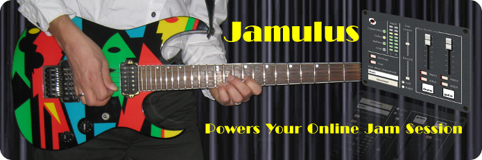

SÁGORA (V1.1, V1.2)
=======================================

Ságora es un fork de Jamulus (https://github.com/corrados/jamulus), el popular software para sesiones de improvisación sobre internet.

Ságora esta orientado a mejorar las condiciones de ensayo y educación musical de docentes y estudiantes de música en este contexto de pandemia COVID-19. Para eso se plantea la creación de salas privadas de ensayo (llamadas servidores en Jamulus) y se permite el agregado de servidores centrales de forma dinamica.

En Ságora se han implementado las siguientes caracteristicas:

- Pantalla inicial con las posibilidad de crear salas y conectarse a salas de ensayo. Esto permite al usuario seleccionar entre la creación de una sala (servidor) o unirse a una sala. Esta modificación ha sido implementada en base a las caracteristicas de creación de clientes y servidores de Jamulus.

- Selector de Servidores Centrales tanto para la creación de salas como la conexión a salas. De esta manera se puede seleccionar la creación de una sala en el servidor central más cercano. Esto puede significar una reducción en la latencia teniendo en cuenta el extenso territorio argentino y americano. Esta modificación se ha llevado a cabo a partir del uso del modulo QNetworkAccessManager de QT el cual permite descargar un archivo con la lista de servidores actualizadas. De esta manera se puede agregar información de nuevos servidores centrales que se vayan añadiendo a lo largo del territorio y dar la posibilidad a los usuarios de conectarse al mas cercano mejorando la experiencia.

- Creación de salas privadas mediante la utilización de passwords. Esta caracteristica permite a los usuarios crear salas privadas a partir del uso de un password. De esta manera organizaciones de musicos y docentes de musica pueden conectarse a las salas de forma privada con el fin de ensayar o tomar o dar clases. Esta modificación ha sido implementada en base a las caracteristicas de creación de servidores de Jamulus, creando un input text que funcione como password de la sala y validando el mismo una vez que el usuario selecciono una sala en la lista de salas (servidores).

- Se ha implementado la función JamRecorder, la cual existe y puede ser utilizada en Jamulus a partir de su ejecución en la terminal. JamRecorder permite la grabación multicanal de las sesiones dentro de la sala, con el agregado de que genera un proyecto en el popular software de grabación y procesamiento de audio, Reaper. La implementación dentro de Sagora se da a partir de un boton toogle en la pantalla de creacion de sala (servidor). Esto permite que el usuario que crea el servidor pueda habilitar o deshabilitar la grabación.

- Se ha implementado un panel de efectos en la ventana de cliente, que permite habilitar Trémolo, Ring Modulator y Delay a la señal de audio del cliente. Para esto se han utilizado como guia los tutoriales de https://wiki.analog.com/resources/tools-software/sharc-audio-module/baremetal/

- Se ha implementado al grabnación de la sesión desde el lado del cliente a un canal esetreo, ya que antes solo se podía hacer esto desde el servidores. Esto permite que cualquier cliente conectado a la sesión, pueda realizar una grabación.

Desarrolladores que han participado en el proyecto Ságora: Nicolás Rodriguez Altieri, Juan Manuel Lopez Gargiulo, Francisco De Martino, Esteban Calcagno.
Diseñadores que han participado en el diseño de la interface y experiencia de usuario de Ságora: Ignacio Maiocco, Rodrigo Funes, Diego Romero Mascaró.

======================================================================

SÁGORA (V1.1, V1.2)
=======================================

Ságora is a fork of Jamulus (https://github.com/corrados/jamulus), the popular software for jam sessions on the internet.

Ságora is aimed at improving the music rehearsal and education conditions for music teachers and students in this context of the COVID-19 pandemic. For that, the creation of private rehearsal rooms (called Jamulus servers) is proposed and the addition of central servers is allowed dynamically.

In Ságora the following features have been implemented:

- Initial screen with the possibility of creating rooms and connecting to rehearsal rooms. This allows the user to select between creating a room (server) or joining a room. This modification has been implemented based on Jamulus client and server creation features.

- Central Server Selector for both the creation of rooms and the connection to rooms. In this way you can select to create a room on the closest central server. This may mean a reduction in latency taking into account the extensive Argentine and American territory. This modification has been carried out from the use of QT's QNetworkAccessManager module which allows downloading a file with the updated list of servers. In this way it is possible to add information from new central servers that are being added throughout the territory and give the possibility to users to connect to the closest one, improving the experience.

- Creation of private rooms through the use of passwords. This feature allows users to create private rooms by using a password. In this way organizations of musicians and music teachers can connect to the rooms privately in order to rehearse or take or give classes. This modification has been implemented based on Jamulus' server creation characteristics, creating a text input that works as a room password and validating it once the user selects a room in the list of rooms (servers).

- The JamRecorder function has been implemented, which exists and can be used in Jamulus from its execution in the terminal. JamRecorder enables multi-channel recording of in-room sessions, with the addition of generating a project in popular audio recording and processing software, Reaper. The implementation within Sagora is given from a toogle button on the room creation screen (server). This allows the user who creates the server to enable or disable recording.

- An effects panel has been implemented in the client window, which allows enabling Tremolo, Ring Modulator and Delay to the client's audio signal. For this, the tutorials at https://wiki.analog.com/resources/tools-software/sharc-audio-module/baremetal/ have been used as a guide

- It has been implemented to record the session from the client side to a stereo channel, since previously this could only be done from the servers. This allows any client connected to the session to make a recording.

Developers who have participated in the Ságora project: Nicolás Rodriguez Altieri, Juan Manuel Lopez Gargiulo, Francisco De Martino, Esteban Calcagno.
Designers who have participated in the design of the interface and user experience of Ságora: Ignacio Maiocco, Rodrigo Funes, Diego Romero Mascaró.

---

## Build environment based on Docker

To build the container, you can run:

    docker build -t sagora:latest - < Dockerfile

Then, to launch the AppImage build in the container:

    docker run -it --rm -v $PWD:/sagora sagora:latest ./appimage.sh

Afterwards, you should see `Sagora-******-x86_64.AppImage` appear on the repository root.

---

======================================================================

Jamulus - Internet Jam Session Software
=======================================

The Jamulus software enables musicians to perform real-time jam sessions over the internet.
There is one server running the Jamulus server software which collects the audio data from
each Jamulus client, mixes the audio data and sends the mix back to each client.

Jamulus is __Open Source software__ ([GPL, GNU General Public License](http://www.gnu.org/licenses/gpl-2.0.html))
and runs under __Windows__ ([ASIO](http://www.steinberg.net)),
__MacOS__ ([Core Audio](https://developer.apple.com/documentation/coreaudio)) and
__Linux__ ([Jack](http://jackaudio.org)).
It is based on the [Qt framework](https://www.qt.io) and uses the [OPUS](http://www.opus-codec.org) audio codec.

The project is hosted at [Sourceforge.net](http://sourceforge.net/projects/llcon).

Required Hardware Setup
-----------------------

The required minimum internet connection speed is 200 kbps (0.2Mbps) for the up and down-stream.
The ping time (i.e. round trip delay) from your computer to the server should not exceed 40 ms average.

For the Jamulus software to run stable it is recommended to use a PC with at least 1.5 GHz CPU frequency.

On a Windows operating system it is recommended to use a sound card with a native ASIO driver.
This ensures to get the lowest possible latencies.

Download and Installation
-------------------------

Download the latest version for [Windows, Macintosh or Linux here](https://sourceforge.net/projects/llcon/files/).

**Windows users**: The Jamulus client software requires an ASIO sound card driver to be available in the system.
If your sound card does not have native ASIO support, you can try out [this alternative](http://www.asio4all.org/)

Help
----

Official documentation for Jamulus is on the [Github wiki](https://github.com/corrados/jamulus/wiki)

See also the [discussion forums](https://sourceforge.net/p/llcon/discussion)

Bugs and feature requests can be [reported here](https://github.com/corrados/jamulus/issues)

Compilation and Development
---------------------------

See the [compile Instructions](INSTALL.md)

For setting up and running a server, see [this guide](https://github.com/corrados/jamulus/wiki/Running-a-Server)

Acknowledgments
---------------

This code contains open source code from different sources. The developer(s) want
to thank the developer of this code for making their efforts available under open
source:

- Qt cross-platform application framework: http://www.qt.io

- Opus Interactive Audio Codec: http://www.opus-codec.org

- Audio reverberation code: by Perry R. Cook and Gary P. Scavone, 1995 - 2004
  (taken from "The Synthesis ToolKit in C++ (STK)"):
  http://ccrma.stanford.edu/software/stk

- Some pixmaps are from the Open Clip Art Library (OCAL): http://openclipart.org

- Country flag icons from Mark James: http://www.famfamfam.com

We would also like to acknowledge the contributors listed in the
[Github Contributors list](https://github.com/corrados/jamulus/graphs/contributors).
